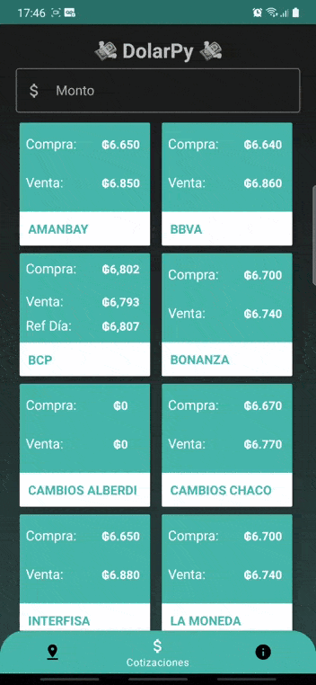

# 💸DolarPy Android Kotlin💸
### 📲Descarga/Download: 
####  AppStore:[Aqui/Here](https://apps.apple.com/us/app/dolarpy-guaraníes-a-dolares/id6447451691)    PlayStore:[Aqui/Here](https://play.google.com/store/apps/details?id=com.lucasginard.dolarpy)    AppGallery:[Aqui/Here](https://appgallery.huawei.com/#/app/C104598987?sharePrepath=ag&locale=es_US&source=appshare&subsource=C104598987)
 

🌐WebService: https://dolar.melizeche.com/api/1.0/

Versión Android en Kotlin de 💸DolarPy💸: https://dolar.melizeche.com/

:octocat: Repo: https://github.com/melizeche/dolarPy

## Construido con 🛠️ (Build in)
* [AndroidStudio](https://developer.android.com/studio) - v4.2.2
* [Kotlin](https://kotlinlang.org) - Lenguaje/Language - v1.5.10
* [MVVM](https://es.wikipedia.org/wiki/Modelo–vista–modelo_de_vista) - Arquitectura/Architecture 👷

## Librerias Utilizadas 📚 (Libraries used)
* [RetroFit](https://square.github.io/retrofit/) - v2.9.0
* [ViewBinding](https://developer.android.com/topic/libraries/view-binding)
* [Coroutines](https://github.com/Kotlin/kotlinx.coroutines) - v1.4.1
* [Room](https://developer.android.com/jetpack/androidx/releases/room) - v2.3.0
* [LiveData & Lifecycle](https://developer.android.com/jetpack/androidx/releases/lifecycle) - v2.3.1
* [Android Gif Drawable](https://github.com/koral--/android-gif-drawable) - v1.2.23

## App Corriendo 	🏃 (Running app)

